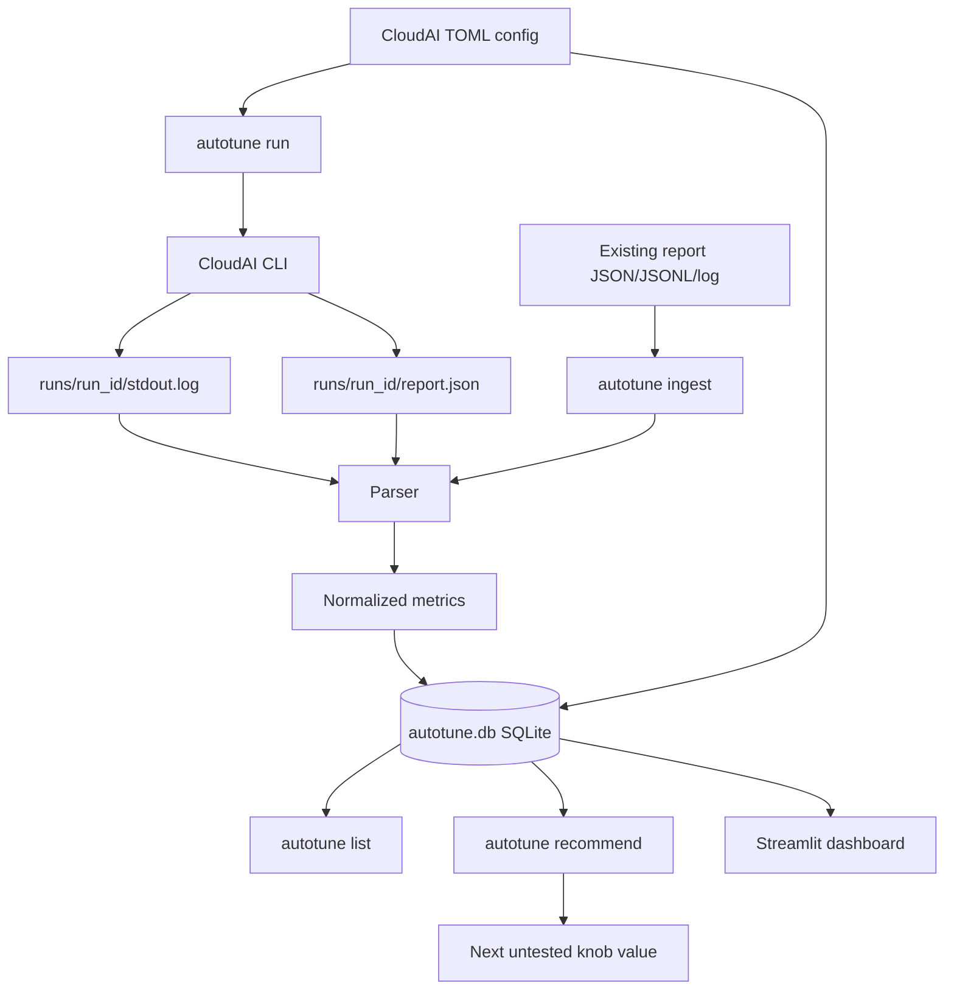

# CloudAI Autotune

CloudAI Autotune is a lightweight experiment manager for LLM serving
benchmarks. It sits on top of [NVIDIA CloudAI](https://github.com/NVIDIA/cloudai):
CloudAI runs the benchmark, while Autotune records what was tried, parses the
result, stores the metrics, and recommends the next config value to test.

It is designed for the common tuning loop:

```text
try a config -> measure throughput/latency -> compare history -> choose next config
```

Example:

```text
Run 1: batch_size = 1   ->  120 tok/s,  90 ms latency
Run 2: batch_size = 4   ->  330 tok/s, 160 ms latency
Run 3: batch_size = 8   ->  430 tok/s, 260 ms latency

Recommendation: try batch_size = 6 because 8 crossed the latency budget and 6
has not been tested yet.
```

## What Autotune Is

Autotune is:

- a CLI for running or ingesting CloudAI benchmark experiments
- a parser for JSON, JSONL, and text benchmark outputs
- a SQLite experiment database
- a simple recommender for the next knob value to try
- a Streamlit dashboard for browsing experiment history

Autotune is not:

- a benchmark engine by itself
- a replacement for CloudAI
- a full multi-variable optimizer yet
- a storage trace, POSIX/S3, or checkpoint I/O benchmark tool

## Architecture



The important boundary is that CloudAI owns benchmark execution. Autotune owns
experiment tracking and recommendation.

## Inputs and Outputs

### Inputs

| Input | Example | Used by |
| --- | --- | --- |
| CloudAI config | `configs/examples/vllm_baseline.toml` | `run`, `derive`, `ingest` |
| Existing report | `reports/examples/vllm_batch4.json` | `ingest`, `demo` |
| Tuning knob | `serving.batch_size` | `recommend`, `demo` |
| Latency budget | `--latency-budget-ms 200` | `recommend`, `demo` |

### Outputs

| Output | Example | Contents |
| --- | --- | --- |
| Experiment DB | `autotune.db` | configs, status, metrics, report paths |
| Run directory | `runs/0001_vllm_baseline_.../` | captured CloudAI artifacts |
| Log file | `runs/.../stdout.log` | CloudAI output or failure details |
| Recommendation | `Suggested: 6.0` | next untested knob value |
| Dashboard | Streamlit app | tables, charts, recommendation view |

## Metrics

Reports are normalized into a small stable metric set:

| Metric | Meaning |
| --- | --- |
| `latency_ms` | latency in milliseconds |
| `ttft_ms` | time to first token in milliseconds |
| `throughput_tokens_per_sec` | generated token throughput |
| `runtime_sec` | benchmark runtime |
| `failure_rate` | failed request ratio |

The parser accepts common aliases from different report formats. For example,
`tokens_per_second`, `request_throughput`, and `output_throughput` can all map
to `throughput_tokens_per_sec`.

## Check Pass/Fail Budgets

After recording runs, check them against simple performance budgets:

```bash
autotune check \
  --latency-budget-ms 200 \
  --ttft-budget-ms 50 \
  --min-throughput-tokens-per-sec 300 \
  --max-failure-rate 0.05
```

Use `--strict` in scripts or CI to exit non-zero if any experiment fails a
budget or cannot be evaluated because a required metric is missing.

## Project Layout

```text
cloudai-autotune/
  autotune/
    cli.py               # command-line interface
    config_mutator.py    # load and derive TOML configs
    runner.py            # CloudAI subprocess wrapper
    parser.py            # report/log -> normalized metrics
    database.py          # SQLite experiment store
    recommender.py       # next-value recommendation heuristic
  configs/examples/      # sample CloudAI configs
  reports/examples/      # sample benchmark reports
  dashboard/app.py       # Streamlit dashboard
  runs/                  # captured run artifacts
  tests/                 # unit tests
```

## Setup

```bash
python3 -m venv .venv
source .venv/bin/activate
pip install -e .
```

Check the CLI:

```bash
autotune --help
```

CloudAI is only required for real benchmark runs. The local demo works without
CloudAI, GPUs, or cluster access.

## Quick Demo Without CloudAI

The fastest way to see the project work is:

```bash
autotune demo
```

This command:

1. loads bundled sample reports from `reports/examples/`
2. writes them to `autotune-demo.db`
3. recommends a next value for `serving.batch_size`

Useful options:

```bash
autotune demo --db /tmp/my-demo.db
autotune demo --scenario vllm_baseline
autotune demo --knob serving.batch_size --latency-budget-ms 200
```

## Run a Real CloudAI Scenario

When CloudAI is installed and available as `cloudai`:

```bash
autotune run path/to/test_scenario.toml \
  --notes "baseline before tensor-parallel change" \
  --metadata hardware.gpu=A100 \
  --metadata run.nodes=1 \
  --system-config path/to/system.toml \
  --tests-dir path/to/tests
```

Autotune will:

1. create a database row with `status=running`
2. call `cloudai run --config ... --output ...`
3. capture stdout/stderr under `runs/<run_id>/stdout.log`
4. parse `report.json` or a common summary artifact such as
   `cloudai-summary.json`, `summary.json`, `results.json`, `metrics.json`,
   or JSONL equivalents
5. mark the experiment `completed` or `failed`

Use a custom CloudAI binary if needed:

```bash
autotune run path/to/test_scenario.toml \
  --cloudai-bin /path/to/cloudai \
  --system-config path/to/system.toml \
  --tests-dir path/to/tests
```

Use CloudAI dry-run mode to validate config wiring without launching a real
benchmark:

```bash
autotune run path/to/test_scenario.toml \
  --cloudai-bin /path/to/cloudai \
  --dry-run \
  --system-config path/to/system.toml \
  --tests-dir path/to/tests
```

For a direct CloudAI CLI-contract smoke check without writing an experiment
record:

```bash
autotune smoke-cloudai path/to/test_scenario.toml \
  --cloudai-bin /path/to/cloudai \
  --system-config path/to/system.toml \
  --tests-dir path/to/tests
```

## Ingest Existing Reports

If a benchmark report already exists, record it without launching CloudAI:

```bash
autotune ingest reports/examples/vllm_batch4.json \
  --config configs/examples/vllm_batch4.toml \
  --notes "baseline batch size 4" \
  --metadata hardware.gpu=A100
```

For a first pass when you only have a report artifact, provide the scenario,
backend, and any config values you want Autotune to track:

```bash
autotune ingest reports/examples/vllm_batch4.json \
  --scenario vllm_baseline \
  --backend vllm \
  --set serving.batch_size=4
```

## Derive a New Config

Create a new config by overriding dotted TOML keys:

```bash
autotune derive configs/examples/vllm_baseline.toml configs/derived/batch8.toml \
  --set serving.batch_size=8
```

Then run it:

```bash
autotune run configs/derived/batch8.toml
```

## List Experiments

```bash
autotune list
```

Filter by scenario:

```bash
autotune list --scenario vllm_baseline
```

## Compare Experiments

Show config and metric differences between two recorded runs:

```bash
autotune diff 1 2
```

## Export Results

Write experiment summaries to CSV, JSON, or Markdown for sharing in issues,
pull requests, or benchmark notes:

```bash
autotune export --format csv --out reports/summary.csv
autotune export --format json --scenario vllm_baseline --out reports/vllm.json
autotune export --format markdown --out reports/summary.md
autotune export --format markdown --template issue
autotune export --format markdown --template pr
```

Without `--out`, the export prints to the terminal.

## Get a Recommendation

```bash
autotune recommend --knob serving.batch_size --latency-budget-ms 200
```

The recommender compares completed experiments for one or more knobs. It tries
to avoid suggesting a value that was already tested. If `4` was good and `8`
crossed the latency budget, it may suggest `6` as the next untested point.

To write that suggestion directly into a new config, pass a base config and an
output path:

```bash
autotune recommend \
  --knob serving.batch_size \
  --knob serving.num_requests \
  --latency-budget-ms 200 \
  --derive-from configs/examples/vllm_baseline.toml \
  --out-config configs/derived/batch6.toml
```

This prints one recommendation per knob and writes `configs/derived/batch6.toml`
with the suggested values applied.

## Dashboard

```bash
streamlit run dashboard/app.py
```

The dashboard reads the local SQLite database and shows experiment history,
best/latest run comparison, metric charts, and the current recommendation.

## Development

Run tests:

```bash
.venv/bin/python -m pytest -q
```

Current test coverage includes:

- config derivation
- report parsing
- runner failure handling
- SQLite persistence
- CLI ingest/demo behavior
- recommendation logic

## Roadmap

Goal: make Autotune the small, reliable companion for CloudAI performance
tuning — easy enough for a first benchmark, useful enough for repeated
production-readiness checks.

- Make the first-run path obvious: one command for demo, one command for an
  existing CloudAI report, and one command for a real CloudAI run.
- Support a stable CloudAI machine-readable summary artifact when CloudAI
  provides one, while keeping workload-specific parsers as fallbacks.
- Continue improving multi-knob recommendations beyond independent knob
  suggestions toward budget-aware search across interacting backend settings.
- Track experiment intent, environment, hardware, and config diffs so results
  are explainable later.
- Expand pass/fail budgets to include time to first token and richer policy
  reporting.
- Make the dashboard useful for comparison: best run, latest run, regressions,
  and suggested next config.
- Expand export templates for issue, pull request, and benchmark-report
  summaries.
- Keep the tool local-first: SQLite by default, no service required, and clean
  failure messages when CloudAI or benchmark artifacts are missing.
