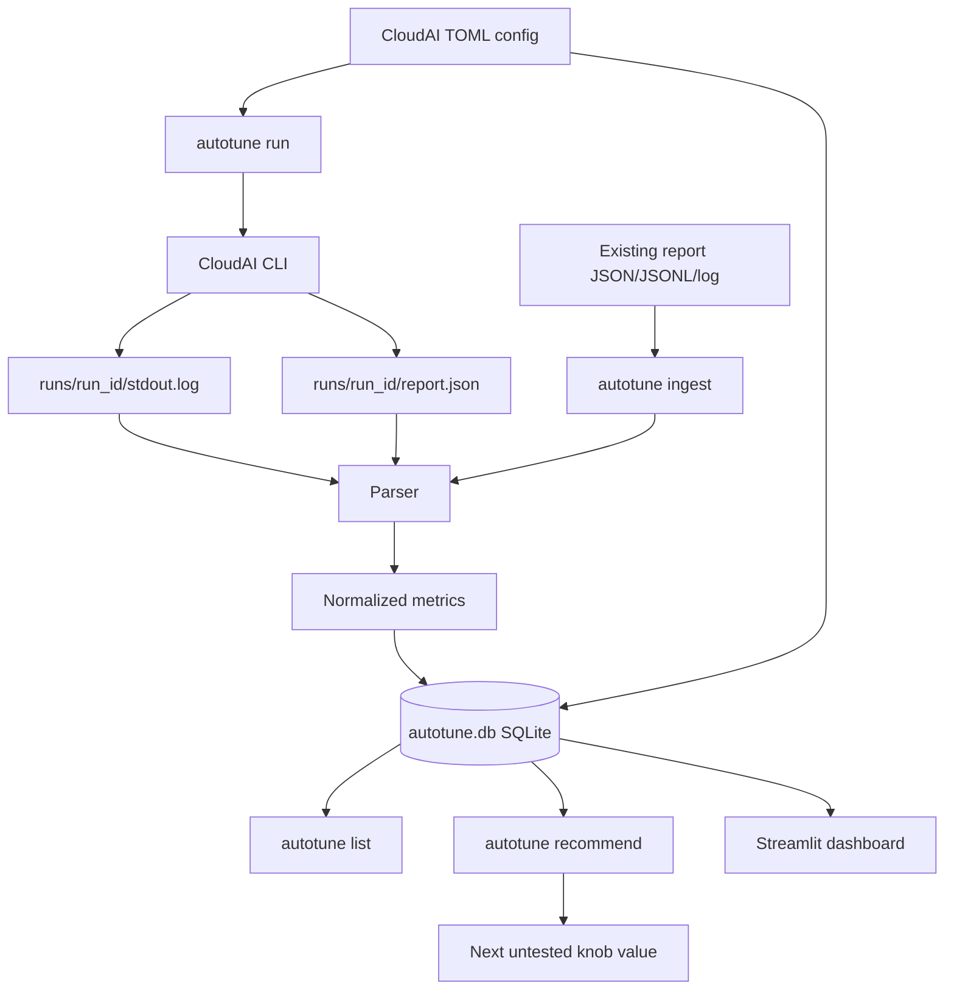

# CloudAI Autotune

CloudAI Autotune is a lightweight experiment manager for LLM serving
benchmarks. It sits on top of [NVIDIA CloudAI](https://github.com/NVIDIA/cloudai):
CloudAI runs the benchmark, while Autotune records what was tried, parses the
result, stores the metrics, and recommends the next config value to test.

It is designed for the common tuning loop:

```text
try a config -> measure throughput/latency -> compare history -> choose next config
```

Example:

```text
Run 1: batch_size = 1   ->  120 tok/s,  90 ms latency
Run 2: batch_size = 4   ->  330 tok/s, 160 ms latency
Run 3: batch_size = 8   ->  430 tok/s, 260 ms latency

Recommendation: try batch_size = 6 because 8 crossed the latency budget and 6
has not been tested yet.
```

## What Autotune Is

Autotune is:

- a CLI for running or ingesting CloudAI benchmark experiments
- a parser for JSON, JSONL, and text benchmark outputs
- a SQLite experiment database
- a simple recommender for the next knob value to try
- a Streamlit dashboard for browsing experiment history

Autotune is not:

- a benchmark engine by itself
- a replacement for CloudAI
- a full multi-variable optimizer yet
- a storage trace, POSIX/S3, or checkpoint I/O benchmark tool

## Architecture


```mermaid
flowchart TD
    A[CloudAI TOML config] --> B[autotune run]
    B --> C[CloudAI CLI]
    C --> D[runs/run_id/stdout.log]
    C --> E[runs/run_id/report.json]

    F[Existing report JSON/JSONL/log] --> G[autotune ingest]

    D --> H[Parser]
    E --> H
    G --> H

    H --> I[Normalized metrics]
    I --> J[(autotune.db SQLite)]
    A --> J

    J --> K[autotune list]
    J --> L[autotune recommend]
    J --> M[Streamlit dashboard]

    L --> N[Next untested knob value]
```

The important boundary is that CloudAI owns benchmark execution. Autotune owns
experiment tracking and recommendation.

## Inputs and Outputs

### Inputs

| Input | Example | Used by |
| --- | --- | --- |
| CloudAI config | `configs/examples/vllm_baseline.toml` | `run`, `derive`, `ingest` |
| Existing report | `reports/examples/vllm_batch4.json` | `ingest`, `demo` |
| Tuning knob | `serving.batch_size` | `recommend`, `demo` |
| Latency budget | `--latency-budget-ms 200` | `recommend`, `demo` |

### Outputs

| Output | Example | Contents |
| --- | --- | --- |
| Experiment DB | `autotune.db` | configs, status, metrics, report paths |
| Run directory | `runs/0001_vllm_baseline_.../` | captured CloudAI artifacts |
| Log file | `runs/.../stdout.log` | CloudAI output or failure details |
| Recommendation | `Suggested: 6.0` | next untested knob value |
| Dashboard | Streamlit app | tables, charts, recommendation view |

## Metrics

Reports are normalized into a small stable metric set:

| Metric | Meaning |
| --- | --- |
| `latency_ms` | latency in milliseconds |
| `ttft_ms` | time to first token in milliseconds |
| `throughput_tokens_per_sec` | generated token throughput |
| `runtime_sec` | benchmark runtime |
| `failure_rate` | failed request ratio |

The parser accepts common aliases from different report formats. For example,
`tokens_per_second`, `request_throughput`, and `output_throughput` can all map
to `throughput_tokens_per_sec`.

## Check Pass/Fail Budgets

After recording runs, check them against simple performance budgets:

```bash
autotune check \
  --latency-budget-ms 200 \
  --ttft-budget-ms 50 \
  --min-throughput-tokens-per-sec 300 \
  --max-failure-rate 0.05
```

Use `--strict` in scripts or CI to exit non-zero if any experiment fails a
budget or cannot be evaluated because a required metric is missing.

## Project Layout

```text
cloudai-autotune/
  autotune/
    cli.py               # command-line interface
    config_mutator.py    # load and derive TOML configs
    runner.py            # CloudAI subprocess wrapper
    parser.py            # report/log -> normalized metrics
    database.py          # SQLite experiment store
    recommender.py       # next-value recommendation heuristic
  configs/examples/      # sample CloudAI configs
  reports/examples/      # sample benchmark reports
  dashboard/app.py       # Streamlit dashboard
  runs/                  # captured run artifacts
  tests/                 # unit tests
```

## Setup

```bash
python3 -m venv .venv
source .venv/bin/activate
pip install -e .
```

Check the CLI:

```bash
autotune --help
```

CloudAI is only required for real benchmark runs. The local demo works without
CloudAI, GPUs, or cluster access.

## Quick Demo Without CloudAI

The fastest way to see the project work is:

```bash
autotune demo
```

This command:

1. loads bundled sample reports from `reports/examples/`
2. writes them to `autotune-demo.db`
3. recommends a next value for `serving.batch_size`

Useful options:

```bash
autotune demo --db /tmp/my-demo.db
autotune demo --scenario vllm_baseline
autotune demo --knob serving.batch_size --latency-budget-ms 200
```

## Run a Real CloudAI Scenario

When CloudAI is installed and available as `cloudai`:

```bash
autotune run path/to/test_scenario.toml \
  --notes "baseline before tensor-parallel change" \
  --metadata hardware.gpu=A100 \
  --metadata run.nodes=1 \
  --system-config path/to/system.toml \
  --tests-dir path/to/tests \
  --hook-dir path/to/hooks
```

Autotune will:

1. create a database row with `status=running`
2. call `cloudai run --config ... --output ...`
3. capture stdout/stderr under `runs/<run_id>/stdout.log`
4. parse `report.json` or a common summary artifact such as
   `cloudai-summary.json`, `summary.json`, `results.json`, `metrics.json`,
   or JSONL equivalents
5. mark the experiment `completed` or `failed`

CloudAI stdout and stderr are preserved in the run's `stdout.log`. Autotune
also appends a diagnostic for launch failures, timeouts, non-zero exits, and
unreadable report artifacts. Failed runs exit non-zero so shell scripts and CI
do not mistake them for successful benchmarks.

Use a custom CloudAI binary if needed:

```bash
autotune run path/to/test_scenario.toml \
  --cloudai-bin /path/to/cloudai \
  --timeout-sec 3600 \
  --system-config path/to/system.toml \
  --tests-dir path/to/tests \
  --hook-dir path/to/hooks
```

Use CloudAI dry-run mode to validate config wiring without launching a real
benchmark:

```bash
autotune run path/to/test_scenario.toml \
  --cloudai-bin /path/to/cloudai \
  --dry-run \
  --system-config path/to/system.toml \
  --tests-dir path/to/tests \
  --hook-dir path/to/hooks
```

For a direct CloudAI CLI-contract smoke check without writing an experiment
record:

```bash
autotune smoke-cloudai path/to/test_scenario.toml \
  --cloudai-bin /path/to/cloudai \
  --system-config path/to/system.toml \
  --tests-dir path/to/tests \
  --hook-dir path/to/hooks
```

## Ingest Existing Reports

If a benchmark report already exists, record it without launching CloudAI:

```bash
autotune ingest reports/examples/vllm_batch4.json \
  --config configs/examples/vllm_batch4.toml \
  --notes "baseline batch size 4" \
  --metadata hardware.gpu=A100
```

For a first pass when you only have a report artifact, provide the scenario,
backend, and any config values you want Autotune to track:

```bash
autotune ingest reports/examples/vllm_batch4.json \
  --scenario vllm_baseline \
  --backend vllm \
  --set serving.batch_size=4
```

## Derive a New Config

Create a new config by overriding dotted TOML keys:

```bash
autotune derive configs/examples/vllm_baseline.toml configs/derived/batch8.toml \
  --set serving.batch_size=8
```

Then run it:

```bash
autotune run configs/derived/batch8.toml
```

## List Experiments

```bash
autotune list
```

Filter by scenario:

```bash
autotune list --scenario vllm_baseline
```

## Compare Experiments

Show config and metric differences between two recorded runs:

```bash
autotune diff 1 2
```

## Export Results

Write experiment summaries to CSV, JSON, or Markdown for sharing in issues,
pull requests, or benchmark notes:

```bash
autotune export --format csv --out reports/summary.csv
autotune export --format json --scenario vllm_baseline --out reports/vllm.json
autotune export --format markdown --out reports/summary.md
autotune export --format markdown --template issue
autotune export --format markdown --template pr
```

Without `--out`, the export prints to the terminal.

The `pr` template includes a Regression Check comparing the latest completed
run against the completed run immediately before it — a run can regress
against its immediate predecessor without being the worst run ever recorded,
which the best/latest comparison alone wouldn't catch.

## Get a Recommendation

```bash
autotune recommend --knob serving.batch_size --latency-budget-ms 200
```

The recommender compares completed experiments for one or more knobs. It tries
to avoid suggesting a value that was already tested. If `4` was good and `8`
crossed the latency budget, it may suggest `6` as the next untested point.

`recommend` accepts the same budget policy as `autotune check` — latency,
time to first token, minimum throughput, runtime, and failure rate — so a run
that regresses on any one of them is treated as over budget, not just latency:

```bash
autotune recommend \
  --knob serving.batch_size \
  --latency-budget-ms 200 \
  --ttft-budget-ms 50 \
  --min-throughput-tokens-per-sec 300 \
  --max-failure-rate 0.05
```

To write that suggestion directly into a new config, pass a base config and an
output path:

```bash
autotune recommend \
  --knob serving.batch_size \
  --knob serving.num_requests \
  --latency-budget-ms 200 \
  --derive-from configs/examples/vllm_baseline.toml \
  --out-config configs/derived/batch6.toml
```

If you don't already know every knob that's been tuned, `--all-knobs` reports
a recommendation for every numeric dotted config key seen across completed
runs, instead of requiring `--knob` per key:

```bash
autotune recommend --all-knobs --latency-budget-ms 200
```

`--all-knobs` and `--knob` are mutually exclusive.

This prints one recommendation per knob and writes `configs/derived/batch6.toml`
with the suggested values applied.

By default, each `--knob` gets its own independent recommendation, as if the
other knobs didn't exist. To look at combinations of knobs together instead,
add `--joint` (needs at least two `--knob` values, and can't be combined with
`--all-knobs`):

```bash
autotune recommend \
  --knob serving.batch_size \
  --knob serving.num_requests \
  --joint
```

This reports the best *combination* tried so far (by the same throughput/latency
efficiency score used elsewhere) plus the Pareto frontier, every other combo
that isn't strictly beaten on both throughput and latency by another one, so
real tradeoffs stay visible instead of being collapsed into one number.

`--joint` only reports on combinations you've already run. To also get a
suggestion for one *untried* combination, add `--explore` (requires `--joint`):

```bash
autotune recommend \
  --knob serving.batch_size \
  --knob serving.num_requests \
  --joint --explore
```

This starts from the best combo found and picks one knob to grow or shrink,
holding the others fixed, reusing the same doubling/halving trend logic
`recommend_next` already uses for a single knob, just applied per-knob around
the best combo's own value for every other knob rather than blindly. It prefers
whichever knob's own trend still looks like it's scaling well; if the natural
next value for every knob has already been tried, it says so rather than
repeating a combo you've already run.

There's no separate "search budget" to configure: like every other Autotune
recommendation, this is one suggestion per call, run it, ingest the result,
call `recommend --joint --explore` again for the next one. `--derive-from`/
`--out-config` write the exploration suggestion (or the best combo, if
`--explore` finds nothing new) into a new config.

`--explore` only ever changes one knob per suggestion. To let a suggestion
change two or more knobs *at once*, use `--search` instead (mutually exclusive
with `--explore`, also requires `--joint`):

```bash
autotune recommend \
  --knob serving.batch_size \
  --knob serving.num_requests \
  --joint --search
```

This considers a bounded neighborhood around the best combo, one step up and
one step down per knob, combined across all knobs, capped at `--max-candidates`
(default 20) to stay bounded as the number of knobs grows. Since there's no
real efficiency measurement for a combo that's never been run, each untried
candidate is scored by how many knobs land on that knob's own independently
promising direction (the same isolated trend `--explore` uses per knob),
preferring fewer simultaneous changes as a tiebreak. It's still a heuristic
proxy, not a measurement, and it's still one suggestion per call with no
separate search-budget state.

`--search`'s trend-alignment score is still a proxy, not a measurement. For a
real objective function fit to observed data, use `--optimize` instead
(mutually exclusive with `--search`/`--explore`, also requires `--joint`):

```bash
autotune recommend \
  --knob serving.batch_size \
  --knob serving.num_requests \
  --joint --optimize
```

This fits a quadratic response surface (`efficiency ~ b0 + sum(bi*xi +
ci*xi^2)`) by least squares over every completed, in-budget combo tried so
far, and scores the same bounded neighborhood `--search` considers by
*predicted* efficiency instead of trend alignment. With too little data to
fit reliably — fewer distinct combos than free parameters, or a
rank-deficient fit (e.g. only two distinct values ever tried for some knob,
making its linear and squared terms collinear) — it falls back to
`--search`'s heuristic and says so, rather than guessing; this doubles as an
explore-first-then-exploit switch as real data accumulates. Every suggestion
is recorded in the database so a pending untried combo isn't suggested again
on the next call; once you actually run it and ingest the result, it becomes
a normal completed experiment and is folded into the next fit, which is how
a suggestion that turns out wrong changes future ones, without any separate
demotion logic.

## Ingest DSE Sweeps

If a CloudAI scenario used a swept (sweep-configured) parameter, CloudAI's own
DSE grid search logs one row per trial to a `trajectory.csv` under the results
directory. `ingest-dse` finds every `trajectory.csv` under a results directory
and records each sweep as an experiment, with its per-trial data available in
the dashboard:

```bash
autotune ingest-dse results/ --db autotune.db
```

Each sweep becomes one experiment (`backend=cloudai-dse`) with `best_reward`,
`best_step`, and `num_trials` recorded as its metrics. This only visualizes
sweeps CloudAI already ran; it doesn't add new search logic on top.

## Dashboard

```bash
streamlit run dashboard/app.py
```

The dashboard reads the local SQLite database and shows experiment history,
best/latest run comparison, a regression check against the immediately
preceding run, metric charts, and the current recommendation. If any ingested
runs came from `ingest-dse`, a "DSE sweeps" section also shows a reward-per-trial
chart and the best action found for a selected sweep.

## Development

Run tests:

```bash
.venv/bin/python -m pytest -q
```

Lint and format check (matches CI):

```bash
.venv/bin/python -m ruff check autotune dashboard tests
.venv/bin/python -m ruff format --check autotune dashboard tests
```

Current test coverage includes:

- config derivation
- report parsing
- runner failure handling
- SQLite persistence
- CLI ingest/demo behavior
- recommendation logic

## Roadmap

Goal: make Autotune the small, reliable companion for CloudAI performance
tuning — easy enough for a first benchmark, useful enough for repeated
production-readiness checks.

Shipped: one-command demo/ingest/run paths, `cloudai-summary.json` support
with workload-specific fallbacks, TTFT/runtime/failure-rate budgets, explainable
runs (intent, metadata, config diffs), issue/PR/benchmark export templates,
local-first SQLite storage, clean non-zero-exit failure handling for a
missing/failing CloudAI binary, a dashboard runtime-budget input, `ruff`
lint/format checks in CI, run-over-run regression tracking
(`compare_latest_to_previous`) surfaced in both the dashboard and the `pr`
export template, multi-knob *visibility* via `recommend --all-knobs`
(discovers every numeric config key seen across completed runs, rather than
requiring `--knob` per key up front), and DSE sweep ingestion/visualization
(`autotune ingest-dse`), which parses CloudAI's own `trajectory.csv` sweep
logs (from `cloudai_gym.py`'s grid search) into the same SQLite store and
dashboard, so a sweep CloudAI already ran can be browsed without
reimplementing any search logic, joint multi-knob *reporting* via
`recommend --joint` (best combination tried so far, plus the Pareto frontier
of real tradeoffs, across two or more knobs looked at together instead of
independently), and joint multi-knob *exploration* via `recommend --joint
--explore` (suggests one untried combination by extending the best combo on
whichever knob's own trend still looks like it's scaling well, reusing the
same doubling/halving heuristic already used for a single knob rather than a
new search algorithm), and multi-knob *joint search* via `recommend --joint
--search` (suggests one untried combination that may change two or more knobs
at once, scoring a bounded, capped neighborhood by how many knobs land on
their own independently promising direction, still a heuristic proxy since
untried combos have no real measurement to rank by), and a
measurement-driven search strategy via `recommend --joint --optimize`
(`autotune/optimizer.py`), which replaces that heuristic proxy with a
quadratic response surface (`efficiency ~ b0 + sum(bi*xi + ci*xi^2)`) fit by
least squares over every completed, in-budget combo tried so far, scoring the
same bounded neighborhood by *predicted* efficiency instead of trend
alignment. With too little data to fit reliably (fewer distinct combos than
free parameters, or a rank-deficient fit, e.g. only two distinct values tried
for some knob), it falls back to `--search`'s heuristic rather than guessing
— an implicit explore-first-then-exploit switch as real data accumulates.
Suggestions are tracked in a `search_suggestions` table so a pending
untried combo isn't suggested twice; once it's actually run, the outcome
becomes a normal completed experiment and is included in the next fit, which
is how a bad suggestion feeds back into future ones without any separate
demotion logic. Kept local-first by design, not a target with an end state —
every new item below should keep working with zero services.

### Later — needs your input before any code gets written

- **Contributing improvements back to CloudAI itself.** Autotune's own
  multi-knob search work (`--joint`, `--explore`, `--search`, `--optimize`)
  duplicates capability CloudAI's own DSE stack could have natively:
  `configurator/base_agent.py` defines a generic, pluggable agent interface,
  but `GridSearchAgent` (exhaustive grid search) is the only implementation
  that ships, and `report_generator/dse_report.py` only ever reports a single
  scalar "best" step, no Pareto frontier across competing metrics. Porting
  the fitted-surface search from `--optimize` into a new `BaseAgent`
  implementation, and porting `--joint`'s Pareto frontier into `DSEReport`,
  are both real upstream candidates now that there's working, tested logic to
  point to instead of a bare proposal — not started, needs scoping as its own
  design conversation (and its own maintainer back-and-forth, separate from
  the in-flight lazy-loading/`[[Definitions]]` parser work).
