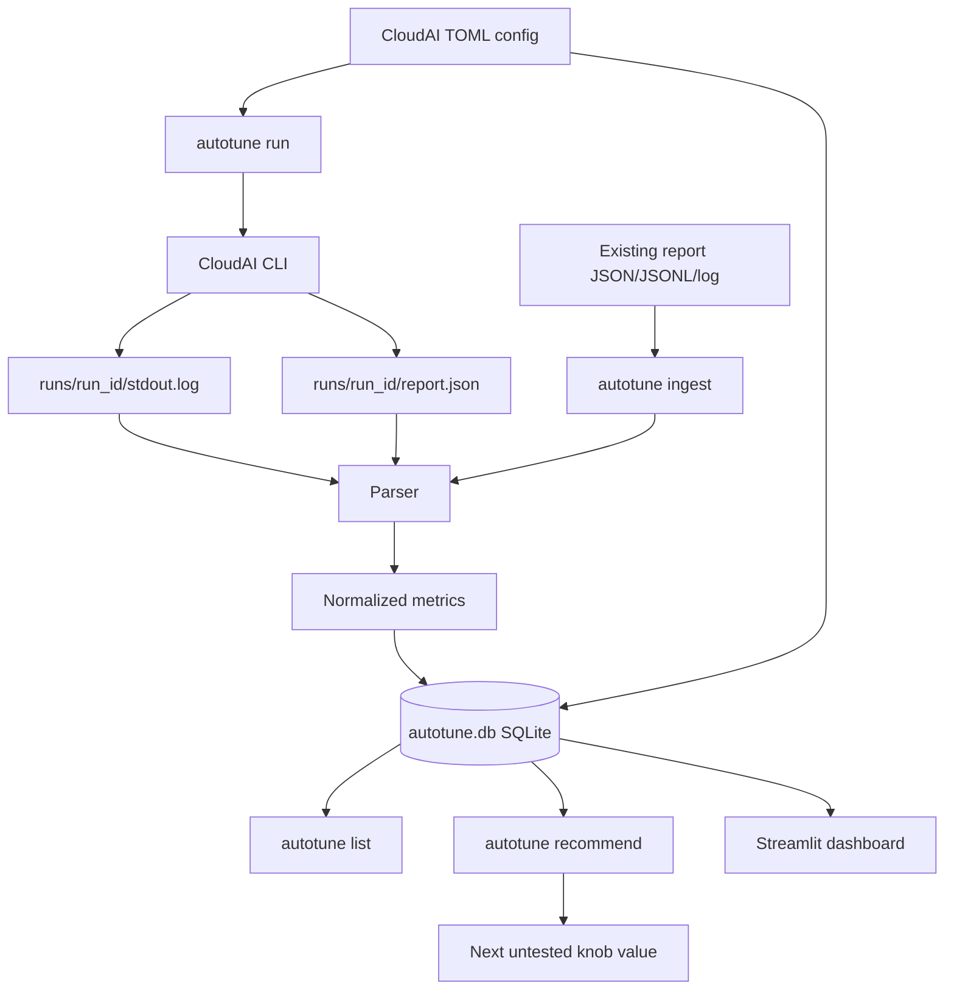

# CloudAI Autotune

CloudAI Autotune is a lightweight experiment manager for LLM serving
benchmarks. It sits on top of [NVIDIA CloudAI](https://github.com/NVIDIA/cloudai):
CloudAI runs the benchmark, while Autotune records what was tried, parses the
result, stores the metrics, and recommends the next config value to test.

It is designed for the common tuning loop:

```text
try a config -> measure throughput/latency -> compare history -> choose next config
```

Example:

```text
Run 1: batch_size = 1   ->  120 tok/s,  90 ms latency
Run 2: batch_size = 4   ->  330 tok/s, 160 ms latency
Run 3: batch_size = 8   ->  430 tok/s, 260 ms latency

Recommendation: try batch_size = 6 because 8 crossed the latency budget and 6
has not been tested yet.
```

## What Autotune Is

Autotune is:

- a CLI for running or ingesting CloudAI benchmark experiments
- a parser for JSON, JSONL, and text benchmark outputs
- a SQLite experiment database
- a simple recommender for the next knob value to try
- a Streamlit dashboard for browsing experiment history

Autotune is not:

- a benchmark engine by itself
- a replacement for CloudAI
- a full multi-variable optimizer yet
- a storage trace, POSIX/S3, or checkpoint I/O benchmark tool

## Architecture


```mermaid
flowchart TD
    A[CloudAI TOML config] --> B[autotune run]
    B --> C[CloudAI CLI]
    C --> D[runs/run_id/stdout.log]
    C --> E[runs/run_id/report.json]

    F[Existing report JSON/JSONL/log] --> G[autotune ingest]

    D --> H[Parser]
    E --> H
    G --> H

    H --> I[Normalized metrics]
    I --> J[(autotune.db SQLite)]
    A --> J

    J --> K[autotune list]
    J --> L[autotune recommend]
    J --> M[Streamlit dashboard]

    L --> N[Next untested knob value]
```

The important boundary is that CloudAI owns benchmark execution. Autotune owns
experiment tracking and recommendation.

## Inputs and Outputs

### Inputs

| Input | Example | Used by |
| --- | --- | --- |
| CloudAI config | `configs/examples/vllm_baseline.toml` | `run`, `derive`, `ingest` |
| Existing report | `reports/examples/vllm_batch4.json` | `ingest`, `demo` |
| Tuning knob | `serving.batch_size` | `recommend`, `demo` |
| Latency budget | `--latency-budget-ms 200` | `recommend`, `demo` |

### Outputs

| Output | Example | Contents |
| --- | --- | --- |
| Experiment DB | `autotune.db` | configs, status, metrics, report paths |
| Run directory | `runs/0001_vllm_baseline_.../` | captured CloudAI artifacts |
| Log file | `runs/.../stdout.log` | CloudAI output or failure details |
| Recommendation | `Suggested: 6.0` | next untested knob value |
| Dashboard | Streamlit app | tables, charts, recommendation view |

## Metrics

Reports are normalized into a small stable metric set:

| Metric | Meaning |
| --- | --- |
| `latency_ms` | latency in milliseconds |
| `ttft_ms` | time to first token in milliseconds |
| `throughput_tokens_per_sec` | generated token throughput |
| `runtime_sec` | benchmark runtime |
| `failure_rate` | failed request ratio |

The parser accepts common aliases from different report formats. For example,
`tokens_per_second`, `request_throughput`, and `output_throughput` can all map
to `throughput_tokens_per_sec`.

## Check Pass/Fail Budgets

After recording runs, check them against simple performance budgets:

```bash
autotune check \
  --latency-budget-ms 200 \
  --ttft-budget-ms 50 \
  --min-throughput-tokens-per-sec 300 \
  --max-failure-rate 0.05
```

Use `--strict` in scripts or CI to exit non-zero if any experiment fails a
budget or cannot be evaluated because a required metric is missing.

## Project Layout

```text
cloudai-autotune/
  autotune/
    cli.py               # command-line interface
    config_mutator.py    # load and derive TOML configs
    runner.py            # CloudAI subprocess wrapper
    parser.py            # report/log -> normalized metrics
    database.py          # SQLite experiment store
    recommender.py       # next-value recommendation heuristic
  configs/examples/      # sample CloudAI configs
  reports/examples/      # sample benchmark reports
  dashboard/app.py       # Streamlit dashboard
  runs/                  # captured run artifacts
  tests/                 # unit tests
```

## Setup

```bash
python3 -m venv .venv
source .venv/bin/activate
pip install -e .
```

Check the CLI:

```bash
autotune --help
```

CloudAI is only required for real benchmark runs. The local demo works without
CloudAI, GPUs, or cluster access.

## Quick Demo Without CloudAI

The fastest way to see the project work is:

```bash
autotune demo
```

This command:

1. loads bundled sample reports from `reports/examples/`
2. writes them to `autotune-demo.db`
3. recommends a next value for `serving.batch_size`

Useful options:

```bash
autotune demo --db /tmp/my-demo.db
autotune demo --scenario vllm_baseline
autotune demo --knob serving.batch_size --latency-budget-ms 200
```

## Run a Real CloudAI Scenario

When CloudAI is installed and available as `cloudai`:

```bash
autotune run path/to/test_scenario.toml \
  --notes "baseline before tensor-parallel change" \
  --metadata hardware.gpu=A100 \
  --metadata run.nodes=1 \
  --system-config path/to/system.toml \
  --tests-dir path/to/tests \
  --hook-dir path/to/hooks
```

Autotune will:

1. create a database row with `status=running`
2. call `cloudai run --config ... --output ...`
3. capture stdout/stderr under `runs/<run_id>/stdout.log`
4. parse `report.json` or a common summary artifact such as
   `cloudai-summary.json`, `summary.json`, `results.json`, `metrics.json`,
   or JSONL equivalents
5. mark the experiment `completed` or `failed`

CloudAI stdout and stderr are preserved in the run's `stdout.log`. Autotune
also appends a diagnostic for launch failures, timeouts, non-zero exits, and
unreadable report artifacts. Failed runs exit non-zero so shell scripts and CI
do not mistake them for successful benchmarks.

Use a custom CloudAI binary if needed:

```bash
autotune run path/to/test_scenario.toml \
  --cloudai-bin /path/to/cloudai \
  --timeout-sec 3600 \
  --system-config path/to/system.toml \
  --tests-dir path/to/tests \
  --hook-dir path/to/hooks
```

Use CloudAI dry-run mode to validate config wiring without launching a real
benchmark:

```bash
autotune run path/to/test_scenario.toml \
  --cloudai-bin /path/to/cloudai \
  --dry-run \
  --system-config path/to/system.toml \
  --tests-dir path/to/tests \
  --hook-dir path/to/hooks
```

For a direct CloudAI CLI-contract smoke check without writing an experiment
record:

```bash
autotune smoke-cloudai path/to/test_scenario.toml \
  --cloudai-bin /path/to/cloudai \
  --system-config path/to/system.toml \
  --tests-dir path/to/tests \
  --hook-dir path/to/hooks
```

## Ingest Existing Reports

If a benchmark report already exists, record it without launching CloudAI:

```bash
autotune ingest reports/examples/vllm_batch4.json \
  --config configs/examples/vllm_batch4.toml \
  --notes "baseline batch size 4" \
  --metadata hardware.gpu=A100
```

For a first pass when you only have a report artifact, provide the scenario,
backend, and any config values you want Autotune to track:

```bash
autotune ingest reports/examples/vllm_batch4.json \
  --scenario vllm_baseline \
  --backend vllm \
  --set serving.batch_size=4
```

## Derive a New Config

Create a new config by overriding dotted TOML keys:

```bash
autotune derive configs/examples/vllm_baseline.toml configs/derived/batch8.toml \
  --set serving.batch_size=8
```

Then run it:

```bash
autotune run configs/derived/batch8.toml
```

## List Experiments

```bash
autotune list
```

Filter by scenario:

```bash
autotune list --scenario vllm_baseline
```

## Compare Experiments

Show config and metric differences between two recorded runs:

```bash
autotune diff 1 2
```

## Export Results

Write experiment summaries to CSV, JSON, or Markdown for sharing in issues,
pull requests, or benchmark notes:

```bash
autotune export --format csv --out reports/summary.csv
autotune export --format json --scenario vllm_baseline --out reports/vllm.json
autotune export --format markdown --out reports/summary.md
autotune export --format markdown --template issue
autotune export --format markdown --template pr
```

Without `--out`, the export prints to the terminal.

## Get a Recommendation

```bash
autotune recommend --knob serving.batch_size --latency-budget-ms 200
```

The recommender compares completed experiments for one or more knobs. It tries
to avoid suggesting a value that was already tested. If `4` was good and `8`
crossed the latency budget, it may suggest `6` as the next untested point.

`recommend` accepts the same budget policy as `autotune check` — latency,
time to first token, minimum throughput, runtime, and failure rate — so a run
that regresses on any one of them is treated as over budget, not just latency:

```bash
autotune recommend \
  --knob serving.batch_size \
  --latency-budget-ms 200 \
  --ttft-budget-ms 50 \
  --min-throughput-tokens-per-sec 300 \
  --max-failure-rate 0.05
```

To write that suggestion directly into a new config, pass a base config and an
output path:

```bash
autotune recommend \
  --knob serving.batch_size \
  --knob serving.num_requests \
  --latency-budget-ms 200 \
  --derive-from configs/examples/vllm_baseline.toml \
  --out-config configs/derived/batch6.toml
```

This prints one recommendation per knob and writes `configs/derived/batch6.toml`
with the suggested values applied.

## Dashboard

```bash
streamlit run dashboard/app.py
```

The dashboard reads the local SQLite database and shows experiment history,
best/latest run comparison, metric charts, and the current recommendation.

## Development

Run tests:

```bash
.venv/bin/python -m pytest -q
```

Lint and format check (matches CI):

```bash
.venv/bin/python -m ruff check autotune dashboard tests
.venv/bin/python -m ruff format --check autotune dashboard tests
```

Current test coverage includes:

- config derivation
- report parsing
- runner failure handling
- SQLite persistence
- CLI ingest/demo behavior
- recommendation logic

## Roadmap

Goal: make Autotune the small, reliable companion for CloudAI performance
tuning — easy enough for a first benchmark, useful enough for repeated
production-readiness checks.

Shipped: one-command demo/ingest/run paths, `cloudai-summary.json` support
with workload-specific fallbacks, TTFT/runtime/failure-rate budgets, explainable
runs (intent, metadata, config diffs), issue/PR/benchmark export templates,
local-first SQLite storage, and clean non-zero-exit failure handling for a
missing/failing CloudAI binary. Kept local-first by design, not a target with
an end state — every new item below should keep working with zero services.

### Now — small, scoped, no open design questions

- **Dashboard is missing a runtime budget input.** `Budgets`/`recommend_next()`
  (`autotune/budgets.py`, `autotune/recommender.py`) already support
  `runtime_budget_sec`, but `dashboard/app.py`'s sidebar only collects
  latency, TTFT, throughput, and failure-rate — so the dashboard silently
  can't apply a budget the CLI already supports. Add the missing sidebar
  input and thread it through.
- **No linting in CI.** `.github/workflows/ci.yml` runs tests + `compileall`
  + a CLI smoke test, but nothing checks style or catches latent bugs
  (unused imports, shadowing, etc.) before merge. Add `ruff check`/`ruff
  format --check`, matching the convention `NVIDIA/cloudai` itself already
  uses — cheap, and keeps the two codebases easier to move between.
- **Comparison only tracks best-vs-latest, not run-over-run regressions.**
  `comparison.compare_best_and_latest` compares the newest completed run
  against the best-ever completed run. A run that regressed against the run
  immediately before it — but isn't the global worst — never gets flagged.
  Add a `compare_latest_to_previous` alongside the existing best/latest
  comparison and surface it in the dashboard and `export`.

### Next — needs one scoping decision, then bounded work

- **Multi-knob visibility, not multi-knob search.** `recommend_next()` is
  single-knob (`DEFAULT_KNOB = "serving.batch_size"`), and `--knob` already
  lets you sweep any one dotted key. The lowest-risk next step is a
  `recommend-set` command that reports the current best-observed value for
  *every* knob seen across experiment history in one call, instead of
  re-running `recommend --knob X` per knob by hand. This is coordinate-wise
  reporting on top of existing single-knob logic — not a new search
  algorithm, and not the same thing as item below.

### Later — needs your input before any code gets written

- **Joint multi-knob search.** Actually searching *combinations* of knobs
  (not just reporting independent bests) needs a real objective function
  beyond the current throughput/latency ratio, a search-budget model, and a
  decision on whether Autotune should ever suggest untried combinations or
  stay strictly "next single point from history." Don't start this without
  agreeing on scope — it's the one item here that's a genuine design
  project, not a bounded fix.
- **Consider wrapping CloudAI's own DSE instead of competing with it.**
  CloudAI already has a working multi-parameter search stack —
  `cloudai_gym.py`'s Gymnasium env, `GridSearchAgent` and reward-function
  agents in `cloudai/configurator/`, and `trajectory.csv`/`env.csv` step
  logs with reward per config. Before building joint search in Autotune
  (above), it's worth checking whether ingesting and visualizing CloudAI DSE
  trajectories gets most of the value with far less risk of duplicating
  logic CloudAI already maintains.
